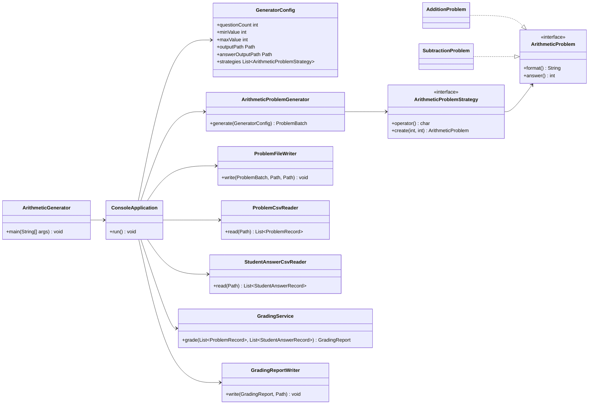
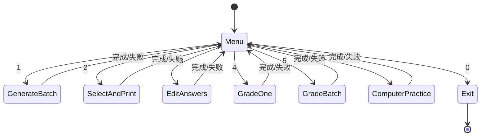
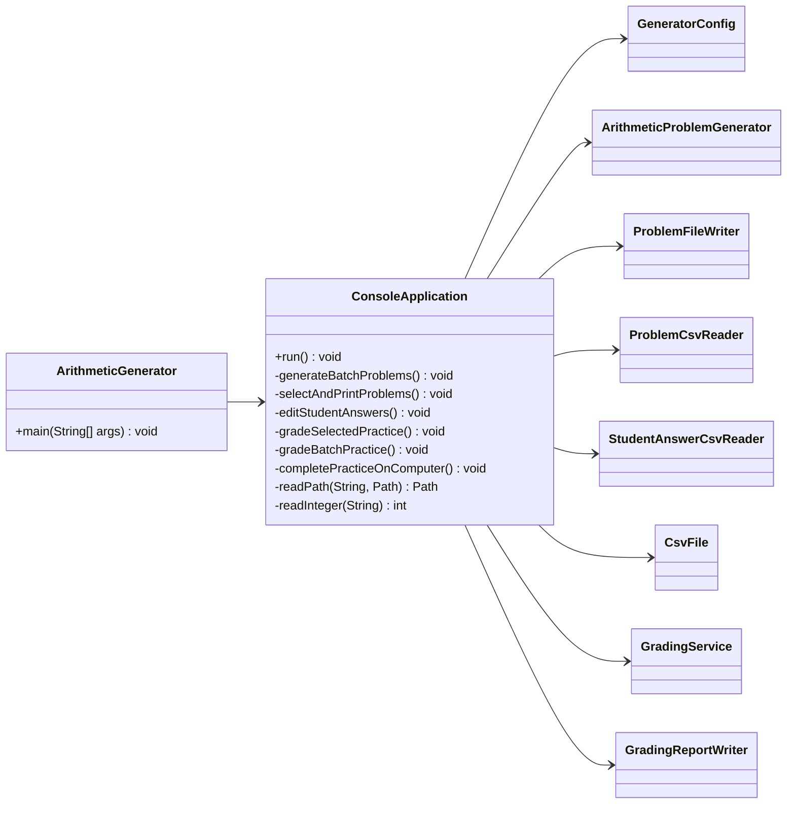
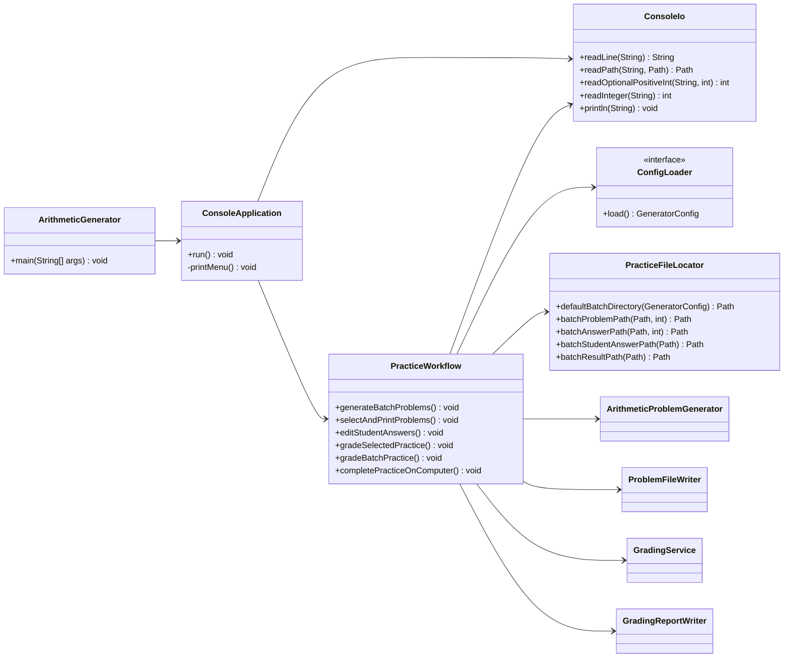

# README

## 1. 画出案例程序的交互流程图


## 2. 用 CSV 文件格式存储数据

程序使用 CSV 保存练习题、标准答案和批改结果，方便用办公软件查看和录入。

- 练习题文件：`index,left,operator,right,expression`
- 标准答案文件：`index,answer`
- 学生作答文件：`index,studentAnswer`
- 批改结果文件：`index,left,operator,right,expression,correctAnswer,studentAnswer,correct`

默认运行主程序会按配置文件生成练习题和标准答案 CSV：

```bash
java com.sylphy.ArithmeticGenerator
```

也可以直接传入生成题目数量，例如生成 20 道题：

```bash
java com.sylphy.ArithmeticGenerator 20
```

批改时使用：

```bash
java com.sylphy.ArithmeticGenerator grade <problems.csv> <student-answers.csv> <results.csv>
```

代码位置：

- `src/main/java/com/sylphy/ArithmeticGenerator.java`：主程序入口，支持生成和批改命令。
- `src/main/java/com/sylphy/csv/CsvFile.java`：CSV 文件读写、转义和解析。
- `src/main/java/com/sylphy/writer/ProblemFileWriter.java`：写出练习题 CSV 和标准答案 CSV。
- `src/main/java/com/sylphy/writer/GradingReportWriter.java`：写出批改结果 CSV。
- `src/main/resources/application.properties`：默认 CSV 输出路径配置。

## 3. 防御性编程，如何处理错误和异常

代码在配置、CSV、题目和批改流程中进行输入校验。

- `GeneratorConfig` 校验题目数量、取值范围和输出路径。
- `CsvFile` 校验空文件、重复表头、列数不一致和引号未闭合。
- `ProblemRecord` 校验题号、运算符和减法非负约束。
- `GradingService` 校验题目不能为空、题号不能重复、作答不能缺失或多余。

代码位置：

- `src/main/java/com/sylphy/config/GeneratorConfig.java`
- `src/main/java/com/sylphy/csv/CsvFile.java`
- `src/main/java/com/sylphy/model/ProblemRecord.java`
- `src/main/java/com/sylphy/model/StudentAnswerRecord.java`
- `src/main/java/com/sylphy/model/GradingReport.java`
- `src/main/java/com/sylphy/service/GradingService.java`

## 4. 字符串和正则表达式处理应用在哪些地方？

字符串处理主要用于 CSV 转义、CSV 解析、题目表达式格式化和配置读取。测试中的 JSON 配置用例使用正则表达式读取字段，避免为了少量测试数据引入额外依赖。

代码位置：

- `src/main/java/com/sylphy/csv/CsvFile.java`：CSV 字符串转义和解析。
- `src/main/java/com/sylphy/model/arithmericproblem/AbstractBinaryArithmeticProblem.java`：题目表达式格式化。
- `src/test/java/com/sylphy/config/GeneratorConfigTest.java`：使用正则表达式读取 JSON 测试数据。

## 5. 数据建模和数据结构有哪些？

主要数据模型包括：

- `ArithmeticProblem`：题目接口。
- `ProblemBatch`：一批题目。
- `ProblemRecord`：CSV 中的一道题。
- `StudentAnswerRecord`：小明的一条作答。
- `GradingResult`：单题批改结果。
- `GradingReport`：一次练习的批改报告。

主要数据结构包括 `List` 保存有序题目、结果和策略配置，`Map` 按题号匹配作答或按运算符匹配策略，`Set` 检查重复题号和重复运算符。

代码位置：

- `src/main/java/com/sylphy/model/arithmericproblem/ArithmeticProblem.java`
- `src/main/java/com/sylphy/model/ProblemBatch.java`
- `src/main/java/com/sylphy/model/ProblemRecord.java`
- `src/main/java/com/sylphy/model/StudentAnswerRecord.java`
- `src/main/java/com/sylphy/model/GradingResult.java`
- `src/main/java/com/sylphy/model/GradingReport.java`
- `src/main/java/com/sylphy/service/GradingService.java`

## 6. 使用表驱动编程应用在哪些地方？

`GeneratorConfig` 保存策略列表，`ProblemCsvReader` 根据这组策略建立 `Map<Character, ArithmeticProblemStrategy>`。程序先通过运算符查表，再把匹配到的策略传给 `ProblemRecord`，由策略创建题目并计算答案。新增运算符时，可以增加一个策略并放入配置，而不是在多个地方写判断分支。

代码位置：

- `src/main/java/com/sylphy/config/GeneratorConfig.java`
- `src/main/java/com/sylphy/reader/ProblemCsvReader.java`
- `src/main/java/com/sylphy/model/ProblemRecord.java`
- `src/main/java/com/sylphy/strategy/ArithmeticProblemStrategy.java`
- `src/main/java/com/sylphy/strategy/AdditionProblemStrategy.java`
- `src/main/java/com/sylphy/strategy/SubtractionProblemStrategy.java`

## 7. 契约式编程应用在哪些地方？

构造方法和服务入口使用参数契约限制非法状态，例如题号必须大于 0、减法结果不能为负、批改结果不能为空、CSV 必须包含指定字段。违反契约时抛出 `IllegalArgumentException`。

代码位置：

- `src/main/java/com/sylphy/config/GeneratorConfig.java`
- `src/main/java/com/sylphy/model/ProblemRecord.java`
- `src/main/java/com/sylphy/model/StudentAnswerRecord.java`
- `src/main/java/com/sylphy/model/GradingReport.java`
- `src/main/java/com/sylphy/reader/ProblemCsvReader.java`
- `src/main/java/com/sylphy/reader/StudentAnswerCsvReader.java`
- `src/main/java/com/sylphy/service/GradingService.java`

## 8. 编写设计文档

当前文档说明了故事 5 的业务流程、CSV 数据格式、异常处理、数据模型、表驱动设计、契约式约束、测试和代码规范。

代码位置：

- `README.md`
- `doc/README-v2.md`

## 9. 测试数据和单元测试

已覆盖核心测试：

- 题目生成、策略和迭代器测试。
- CSV 写入和读取测试。
- 批改服务测试。
- 从 CSV 读取题目和答案、生成批改结果的工作流测试。

代码位置：

- `src/test/java/com/sylphy/service/ArithmeticProblemGeneratorTest.java`
- `src/test/java/com/sylphy/writer/ProblemFileWriterTest.java`
- `src/test/java/com/sylphy/csv/CsvFileTest.java`
- `src/test/java/com/sylphy/service/GradingServiceTest.java`
- `src/test/java/com/sylphy/service/GradingCsvWorkflowTest.java`
- `src/test/resources/generator-config-cases.json`

## 10. Git 代码管理和编程规范

代码按职责分包：

- `config`：配置读取和校验。
- `csv`：CSV 读写基础工具。
- `model`：题目、作答和批改数据模型。
- `reader`：CSV 读取器。
- `service`：生成和批改业务服务。
- `writer`：CSV 写入器。

生成文件仍放在 `output/`，测试和构建产物不应提交。

# 故事 6：用户交互的软件构造

## 1. 设计用户界面原型

控制台界面原型如下，运行主程序后循环显示，用户输入数字并按回车执行：

```text
100以内的口算练习程序
============================================================
功能列表（请输入功能前面对应的数字，按回车键执行）：
------------------------------------------------------------
1. 批量生成练习套卷
2. 选择题目并生成打印版
3. 录入纸面练习答案
4. 批改单套练习
5. 批量批改多套练习
6. 小明电脑练习并批改
0. 退出
============================================================
请选择......
```

代码位置：

- `src/main/java/com/sylphy/ArithmeticGenerator.java`：唯一 `main` 入口。
- `src/main/java/com/sylphy/ConsoleApplication.java`：控制台界面、菜单循环和功能调度。

运行方式：

```bash
mvn -q -DskipTests compile
java -cp target/classes com.sylphy.ArithmeticGenerator
```

## 2. 用户菜单导航（CLI 下的）

菜单功能说明：

- `1`：批量生成多套练习套卷，每套都有题目 CSV 和标准答案 CSV，文件名形如 `practice-001-problems.csv`、`practice-001-answers.csv`。
- `2`：从已有题目 CSV 中按起始题号和数量选择题目，生成一份可打印练习 CSV 和对应答案 CSV。
- `3`：家长根据小明纸面作答逐题录入答案，保存为学生答案 CSV，供后续批改使用。
- `4`：批改单套练习，手动指定一份题目 CSV、一份学生答案 CSV 和一份结果 CSV。
- `5`：批量批改多套练习，扫描目录下所有 `*-problems.csv`，自动匹配 `*-student-answers.csv`，输出 `*-results.csv`。
- `6`：小明在电脑上完成一套练习，程序即时收集答案、自动批改并保存结果。
- `0`：退出程序。

默认流程：先执行 `1`，一路回车会在默认批量目录生成练习；再执行 `2`，一路回车会选择第一套练习并生成打印版；再执行 `3` 录入纸面答案；最后执行 `4` 一路回车即可批改单套练习。

## 3. 程序只有一个 main 入口

程序只有一个启动入口：

```java
com.sylphy.ArithmeticGenerator.main()
```

`main` 只负责启动 `ConsoleApplication`，具体功能由菜单类分发，避免多个程序入口造成使用顺序混乱。

## 4. 交互设计的原则是什么？

本程序采用以下交互原则：

- 单入口：用户只运行一个主程序。
- 数字菜单：每个功能对应一个数字，降低记忆成本。
- 默认路径：常用文件路径提供默认值，减少重复输入。
- 即时反馈：生成、录入、批改后立即提示文件位置和成绩。
- 可退出循环：每次执行完功能后返回菜单，由用户决定何时退出。
- 错误可见：输入错误、文件错误和批改错误显示中文提示，不静默失败。

## 5. 静态程序分析

从故障类型看，当前设计的防护如下：

- 数据故障：`GeneratorConfig` 校验数量和范围，`ProblemRecord` 校验题号、运算符和减法约束。
- 控制故障：`ConsoleApplication` 使用 `switch` 控制菜单状态，非法菜单项给出提示并返回菜单。
- 输入/输出故障：CSV 读取校验空文件、重复表头、列数不一致；写文件前创建目录。
- 接口故障：`ProblemCsvReader` 使用配置中的策略表匹配运算符，避免题目读取和策略实现不一致。
- 存储管理故障：批量数据使用不可变 `ProblemBatch` 和 `GradingReport`，生成文件集中放入 `output/`。

代码位置：

- `src/main/java/com/sylphy/ConsoleApplication.java`
- `src/main/java/com/sylphy/config/GeneratorConfig.java`
- `src/main/java/com/sylphy/csv/CsvFile.java`
- `src/main/java/com/sylphy/reader/ProblemCsvReader.java`
- `src/main/java/com/sylphy/service/GradingService.java`

## 6. 给出程序的类结构 UML 图



## 7. 菜单结构中各个菜单间的状态转换 UML 图



## 8. 测试数据和单元测试

故事 6 新增了菜单流程测试：

- `src/test/java/com/sylphy/ConsoleApplicationTest.java`：覆盖批量生成、批量批改、机器练习。

已有测试继续覆盖生成、CSV、批改和策略逻辑。当前验证命令：

```bash
mvn test
```

## 9. Git 代码管理和编程规范

代码继续按职责分包。故事 6 新增的交互层放在：

- `src/main/java/com/sylphy/ConsoleApplication.java`
- `src/main/java/com/sylphy/console/ConsoleIo.java`
- `src/main/java/com/sylphy/console/PracticeWorkflow.java`
- `src/main/java/com/sylphy/console/PracticeFileLocator.java`

编程规范：

- `main` 保持薄入口。
- `ConsoleApplication` 只负责菜单循环，菜单背后的业务流程放到 `PracticeWorkflow`。
- 生成、读写、批改逻辑继续复用原有 service、reader、writer。
- 不提交 `target/` 和 `output/`。

## 10. 提交到 GitHub 上

GitHub 仓库地址：

- `git@github.com:tanyaoting/plusTest.git`
- `https://github.com/tanyaoting/plusTest`

故事 6 已提交并推送到 `main` 分支。最近一次故事 6 提交：

```text
96fa018 feat: add story 6 console menu
```

本地 `v4` 标签也已推送到远端，用于查看故事 5 完成时的版本。

# 故事 7：软件重构、打包和自动化测试

## 1. 在面向对象的程序设计的基础上对软件程序进行重构

故事 7 的主要问题是：功能越来越多以后，控制台入口类承担了菜单显示、输入校验、默认路径、文件命名和业务流程编排，类职责过重。重构后拆成几个更小的对象：

- `ConsoleApplication`：只负责菜单循环和功能分发。
- `ConsoleIo`：负责控制台输入输出、默认值读取和整数校验。
- `PracticeWorkflow`：负责批量生成、选择打印、录入答案、批改和机器练习的流程编排。
- `PracticeFileLocator`：负责默认路径和批量练习文件命名规则。
- `ConfigLoader`：定义配置加载契约，方便测试替换配置来源。

代码位置：

- `src/main/java/com/sylphy/ConsoleApplication.java`
- `src/main/java/com/sylphy/console/ConsoleIo.java`
- `src/main/java/com/sylphy/console/PracticeWorkflow.java`
- `src/main/java/com/sylphy/console/PracticeFileLocator.java`
- `src/main/java/com/sylphy/console/ConfigLoader.java`

## 2. 重构前的类图和重构后的 UML 类图，比较前后的优缺点

重构前，`ConsoleApplication` 直接依赖配置、读写器、批改服务、CSV 工具、路径规则和控制台输入：



重构后，菜单、交互、流程和路径规则分开：



前后比较：

- 重构前优点：类少，初期容易直接阅读；缺点是 `ConsoleApplication` 过大，路径规则和输入规则混在流程里，后续修改容易互相影响。
- 重构后优点：职责单一，路径规则可以独立测试，控制台输入可以复用，菜单类更稳定；缺点是类数量增加，需要理解对象之间的协作关系。

## 3. 使用了哪些方法进行了重构

本次使用的重构方法：

- 提取类：从 `ConsoleApplication` 中提取 `ConsoleIo`、`PracticeWorkflow`、`PracticeFileLocator`。
- 提取接口：提取 `ConfigLoader`，让配置加载成为可替换契约。
- 移动方法：把路径命名方法移动到 `PracticeFileLocator`，把业务流程方法移动到 `PracticeWorkflow`。
- 保持薄入口：`ArithmeticGenerator.main()` 只启动应用，避免入口承担业务逻辑。
- 用测试保护重构：保留原有菜单流程测试，并新增路径规则测试。

## 4. 将程序打包成一个可执行程序

`pom.xml` 已配置 `maven-jar-plugin`，在 jar 清单中写入主类：

```text
Main-Class: com.sylphy.ArithmeticGenerator
```

打包命令：

```bash
mvn package
```

运行可执行 jar：

```bash
java -jar target/plusTest-1.0-SNAPSHOT.jar
```

如果换到新机器，需要先安装 JDK 21 或兼容的 Java 运行环境，再运行上面的 jar。

代码位置：

- `pom.xml`
- `src/main/java/com/sylphy/ArithmeticGenerator.java`

## 5. TDD 测试驱动开发

本次重构保留了已有测试作为回归保护，并新增了路径命名规则测试，先明确期望行为，再让重构后的对象满足这些测试。

新增测试：

- `src/test/java/com/sylphy/console/PracticeFileLocatorTest.java`：验证默认目录、批量练习题目文件、标准答案文件、学生答案文件和批改结果文件的命名规则。

已有关键测试：

- `src/test/java/com/sylphy/ConsoleApplicationTest.java`：验证菜单默认流程、批量生成、单套批改、批量批改和机器练习。
- `src/test/java/com/sylphy/service/GradingServiceTest.java`：验证批改业务规则。
- `src/test/java/com/sylphy/csv/CsvFileTest.java`：验证 CSV 读写规则。

测试命令：

```bash
mvn test
```

## 6. Git 代码管理和编程规范

故事 7 使用独立分支开发：

```bash
git switch codex/v6
```

提交前检查：

```bash
git status
mvn test
```

编程规范：

- 一个类只承担一个主要职责。
- 控制台文案使用中文，CSV 表头保持英文，便于程序处理。
- 不提交 `target/`、`output/` 等生成目录。
- 新增功能或重构关键规则时补充单元测试。

## 7. 提交到 Gitee 上

当前项目已配置 GitHub 远端：

```text
origin git@github.com:tanyaoting/plusTest.git
```

如果要提交到 Gitee，需要先增加 Gitee 远端地址，例如：

```bash
git remote add gitee <你的 Gitee 仓库 SSH 地址>
git push gitee codex/v6
```

如果要把标签也推送到 Gitee：

```bash
git push gitee --tags
```
