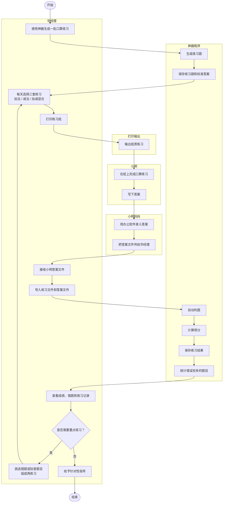

# README

## 1. 画出案例程序的交互流程图


## 2. 用 CSV 文件格式存储数据

程序使用 CSV 保存练习题、标准答案和批改结果，方便用办公软件查看和录入。

- 练习题文件：`index,left,operator,right,expression`
- 标准答案文件：`index,answer`
- 学生作答文件：`index,studentAnswer`
- 批改结果文件：`index,left,operator,right,expression,correctAnswer,studentAnswer,correct`

默认运行主程序会按配置文件生成练习题和标准答案 CSV：

```bash
java com.sylphy.ArithmeticGenerator
```

也可以直接传入生成题目数量，例如生成 20 道题：

```bash
java com.sylphy.ArithmeticGenerator 20
```

批改时使用：

```bash
java com.sylphy.ArithmeticGenerator grade <problems.csv> <student-answers.csv> <results.csv>
```

代码位置：

- `src/main/java/com/sylphy/ArithmeticGenerator.java`：主程序入口，支持生成和批改命令。
- `src/main/java/com/sylphy/csv/CsvFile.java`：CSV 文件读写、转义和解析。
- `src/main/java/com/sylphy/writer/ProblemFileWriter.java`：写出练习题 CSV 和标准答案 CSV。
- `src/main/java/com/sylphy/writer/GradingReportWriter.java`：写出批改结果 CSV。
- `src/main/resources/application.properties`：默认 CSV 输出路径配置。

## 3. 防御性编程，如何处理错误和异常

代码在配置、CSV、题目和批改流程中进行输入校验。

- `GeneratorConfig` 校验题目数量、取值范围和输出路径。
- `CsvFile` 校验空文件、重复表头、列数不一致和引号未闭合。
- `ProblemRecord` 校验题号、运算符和减法非负约束。
- `GradingService` 校验题目不能为空、题号不能重复、作答不能缺失或多余。

代码位置：

- `src/main/java/com/sylphy/config/GeneratorConfig.java`
- `src/main/java/com/sylphy/csv/CsvFile.java`
- `src/main/java/com/sylphy/model/ProblemRecord.java`
- `src/main/java/com/sylphy/model/StudentAnswerRecord.java`
- `src/main/java/com/sylphy/model/GradingReport.java`
- `src/main/java/com/sylphy/service/GradingService.java`

## 4. 字符串和正则表达式处理应用在哪些地方？

字符串处理主要用于 CSV 转义、CSV 解析、题目表达式格式化和配置读取。测试中的 JSON 配置用例使用正则表达式读取字段，避免为了少量测试数据引入额外依赖。

代码位置：

- `src/main/java/com/sylphy/csv/CsvFile.java`：CSV 字符串转义和解析。
- `src/main/java/com/sylphy/model/AbstractBinaryArithmeticProblem.java`：题目表达式格式化。
- `src/test/java/com/sylphy/config/GeneratorConfigTest.java`：使用正则表达式读取 JSON 测试数据。

## 5. 数据建模和数据结构有哪些？

主要数据模型包括：

- `ArithmeticProblem`：题目接口。
- `ProblemBatch`：一批题目。
- `ProblemRecord`：CSV 中的一道题。
- `StudentAnswerRecord`：小明的一条作答。
- `GradingResult`：单题批改结果。
- `GradingReport`：一次练习的批改报告。

主要数据结构包括 `List` 保存有序题目、结果和策略配置，`Map` 按题号匹配作答或按运算符匹配策略，`Set` 检查重复题号和重复运算符。

代码位置：

- `src/main/java/com/sylphy/model/ArithmeticProblem.java`
- `src/main/java/com/sylphy/model/ProblemBatch.java`
- `src/main/java/com/sylphy/model/ProblemRecord.java`
- `src/main/java/com/sylphy/model/StudentAnswerRecord.java`
- `src/main/java/com/sylphy/model/GradingResult.java`
- `src/main/java/com/sylphy/model/GradingReport.java`
- `src/main/java/com/sylphy/service/GradingService.java`

## 6. 使用表驱动编程应用在哪些地方？

`GeneratorConfig` 保存策略列表，`ProblemCsvReader` 根据这组策略建立 `Map<Character, ArithmeticProblemStrategy>`。程序先通过运算符查表，再把匹配到的策略传给 `ProblemRecord`，由策略创建题目并计算答案。新增运算符时，可以增加一个策略并放入配置，而不是在多个地方写判断分支。

代码位置：

- `src/main/java/com/sylphy/config/GeneratorConfig.java`
- `src/main/java/com/sylphy/reader/ProblemCsvReader.java`
- `src/main/java/com/sylphy/model/ProblemRecord.java`
- `src/main/java/com/sylphy/strategy/ArithmeticProblemStrategy.java`
- `src/main/java/com/sylphy/strategy/AdditionProblemStrategy.java`
- `src/main/java/com/sylphy/strategy/SubtractionProblemStrategy.java`

## 7. 契约式编程应用在哪些地方？

构造方法和服务入口使用参数契约限制非法状态，例如题号必须大于 0、减法结果不能为负、批改结果不能为空、CSV 必须包含指定字段。违反契约时抛出 `IllegalArgumentException`。

代码位置：

- `src/main/java/com/sylphy/config/GeneratorConfig.java`
- `src/main/java/com/sylphy/model/ProblemRecord.java`
- `src/main/java/com/sylphy/model/StudentAnswerRecord.java`
- `src/main/java/com/sylphy/model/GradingReport.java`
- `src/main/java/com/sylphy/reader/ProblemCsvReader.java`
- `src/main/java/com/sylphy/reader/StudentAnswerCsvReader.java`
- `src/main/java/com/sylphy/service/GradingService.java`

## 8. 编写设计文档

当前文档说明了故事 5 的业务流程、CSV 数据格式、异常处理、数据模型、表驱动设计、契约式约束、测试和代码规范。

代码位置：

- `README.md`
- `doc/README-v2.md`

## 9. 测试数据和单元测试

已覆盖核心测试：

- 题目生成、策略和迭代器测试。
- CSV 写入和读取测试。
- 批改服务测试。
- 从 CSV 读取题目和答案、生成批改结果的工作流测试。

代码位置：

- `src/test/java/com/sylphy/service/ArithmeticProblemGeneratorTest.java`
- `src/test/java/com/sylphy/writer/ProblemFileWriterTest.java`
- `src/test/java/com/sylphy/csv/CsvFileTest.java`
- `src/test/java/com/sylphy/service/GradingServiceTest.java`
- `src/test/java/com/sylphy/service/GradingCsvWorkflowTest.java`
- `src/test/resources/generator-config-cases.json`

## 10. Git 代码管理和编程规范

代码按职责分包：

- `config`：配置读取和校验。
- `csv`：CSV 读写基础工具。
- `model`：题目、作答和批改数据模型。
- `reader`：CSV 读取器。
- `service`：生成和批改业务服务。
- `writer`：CSV 写入器。

生成文件仍放在 `output/`，测试和构建产物不应提交。
