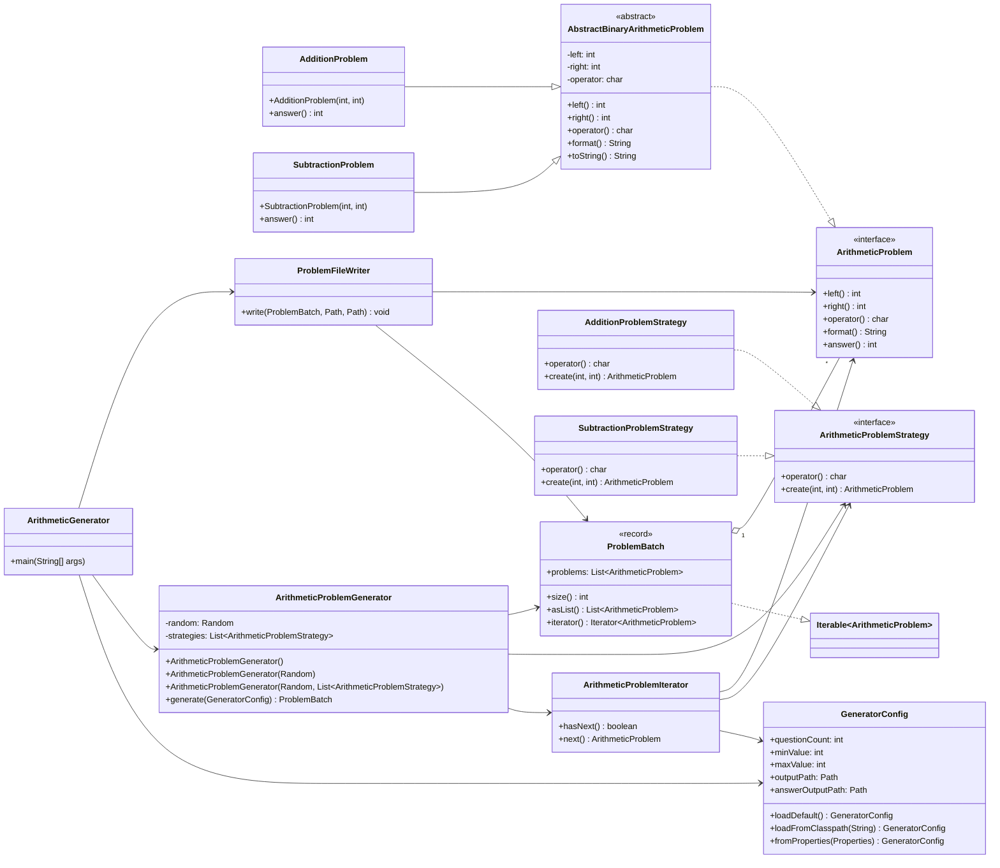

# plusTest 设计说明

本文只说明当前项目如何体现面向对象设计、UML、设计模式、测试和代码管理要求。

## 1. 面向对象核心概念

项目把“算术题”建模为对象，而不是把题目当作简单字符串或零散变量处理。

### 抽象

`ArithmeticProblem` 是题目的公共抽象，定义所有题目都应该具备的行为：

- `left()`：获取左操作数
- `right()`：获取右操作数
- `operator()`：获取运算符
- `format()`：格式化题目
- `answer()`：计算答案

### 封装

`AbstractBinaryArithmeticProblem` 把二元算术题共有的 `left`、`right`、`operator` 封装为私有属性，并通过方法提供只读访问。

`SubtractionProblem` 在构造时校验减法结果不能为负，说明对象不仅保存数据，也负责维护自身合法状态。

### 继承

`AdditionProblem` 和 `SubtractionProblem` 继承 `AbstractBinaryArithmeticProblem`，复用二元算术题的公共属性、格式化、相等性判断等逻辑。

### 多态

`AdditionProblem` 和 `SubtractionProblem` 都实现 `answer()`，但计算规则不同。调用方只面向 `ArithmeticProblem` 使用对象，不需要判断具体题型。

## 2. 单一职责原则

项目按职责拆分类，避免一个类承担过多逻辑。

| 类 | 职责 |
| --- | --- |
| `GeneratorConfig` | 保存并校验题目生成配置 |
| `ArithmeticProblem` | 定义题目的公共行为 |
| `AbstractBinaryArithmeticProblem` | 复用二元算术题的公共状态和方法 |
| `AdditionProblem` | 表示加法题并计算加法答案 |
| `SubtractionProblem` | 表示减法题并计算减法答案 |
| `ArithmeticProblemStrategy` | 定义题目生成策略接口 |
| `AdditionProblemStrategy` | 创建加法题 |
| `SubtractionProblemStrategy` | 创建减法题，并保证减法结果非负 |
| `ArithmeticProblemIterator` | 按配置逐个生成题目 |
| `ArithmeticProblemGenerator` | 组织生成流程并返回题目批次 |
| `ProblemBatch` | 封装一批不可变题目 |
| `ProblemFileWriter` | 输出题目文件和答案文件 |

这种拆分让修改范围更明确。例如，修改输出格式主要影响 `ProblemFileWriter`，修改减法规则主要影响 `SubtractionProblemStrategy`。

## 3. 通过接口或抽象基类解耦

项目中的对象协作主要依赖抽象类型，而不是强依赖具体实现。

### 生成流程解耦

`ArithmeticProblemIterator` 依赖 `ArithmeticProblemStrategy` 接口，而不是直接依赖 `AdditionProblemStrategy` 或 `SubtractionProblemStrategy`。

它只调用：

```java
strategy.create(left, right)
```

具体创建加法题还是减法题，由策略对象决定。

### 输出流程解耦

`ProblemFileWriter` 依赖 `ArithmeticProblem` 接口，只需要调用：

```java
problem.format()
problem.answer()
```

因此，文件写出器不需要知道题目是加法题还是减法题。

### 公共逻辑复用

`AdditionProblem` 和 `SubtractionProblem` 通过继承 `AbstractBinaryArithmeticProblem` 复用公共逻辑，避免重复实现操作数保存、运算符保存和格式化输出。

## 4. 多态服务于扩展性和可维护性

项目中的多态用于降低新增题型时的修改成本。

当前有两个策略实现：

- `AdditionProblemStrategy`
- `SubtractionProblemStrategy`

它们都实现 `ArithmeticProblemStrategy`，所以 `ArithmeticProblemIterator` 可以用同一套代码处理不同策略。

当前有两个题目实现：

- `AdditionProblem`
- `SubtractionProblem`

它们都实现 `ArithmeticProblem`，所以 `ProblemBatch` 和 `ProblemFileWriter` 可以统一处理不同题型。

如果未来新增乘法题，只需要增加：

- `MultiplicationProblem`
- `MultiplicationProblemStrategy`

然后把新策略加入策略列表。生成器、迭代器、批次对象和文件写出器都不需要重写。

## 5. 抽象数据类型

项目中有两个主要抽象数据类型。

### GeneratorConfig

`GeneratorConfig` 表示题目生成配置，包含：

- 题目数量
- 操作数最小值
- 操作数最大值
- 题目输出路径
- 答案输出路径

它在构造阶段校验配置合法性，例如：

- 题目数量必须大于 0
- 最小值不能小于 0
- 最大值不能小于最小值

因此，其他类使用 `GeneratorConfig` 时，可以认为配置已经合法。

### ProblemBatch

`ProblemBatch` 表示题目批次，内部保存 `List<ArithmeticProblem>`。

它提供：

- `size()`：获取题目数量
- `asList()`：获取题目列表
- `iterator()`：按顺序遍历题目

`ProblemBatch` 封装了题目集合，调用方不需要关心内部集合如何维护。

## 6. 抽象类与接口

### 接口

接口用于定义稳定的能力边界。

`ArithmeticProblem` 定义题目能力：

- 获取操作数
- 获取运算符
- 格式化题目
- 计算答案

`ArithmeticProblemStrategy` 定义策略能力：

- 返回当前策略对应的运算符
- 根据左右操作数创建题目

接口让调用方只依赖能力，不依赖具体实现。

### 抽象类

`AbstractBinaryArithmeticProblem` 用于复用二元题目的公共实现。

它统一处理：

- 左操作数
- 右操作数
- 运算符
- 格式化输出
- `toString()`
- `equals()`
- `hashCode()`

具体题型类只需要关注自身不同的答案计算逻辑。

## 7. UML 关系类图设计



这张图体现了以下关系：

- 接口实现：题目类实现 `ArithmeticProblem`，策略类实现 `ArithmeticProblemStrategy`。
- 继承关系：加法题和减法题继承二元算术题抽象基类。
- 聚合关系：`ProblemBatch` 聚合多个题目。
- 依赖关系：生成器依赖迭代器和策略，写文件器依赖题目批次。
- 工厂关系：`ArithmeticProblemGenerator.Factory` 作为静态内部类负责创建生成器。

## 8. 设计模式的运用

### 策略模式

策略模式用于封装不同题型的创建规则。

| 策略类 | 行为 |
| --- | --- |
| `AdditionProblemStrategy` | 直接使用左右操作数创建加法题 |
| `SubtractionProblemStrategy` | 先调整操作数顺序，保证减法结果非负，再创建减法题 |

生成器不需要知道每种题型的创建细节，只需要持有策略列表。

### 迭代器模式

`ArithmeticProblemIterator` 负责逐个生成题目。

它通过：

- `hasNext()` 判断是否还需要生成
- `next()` 生成下一道题

生成器只需要循环调用迭代器，不需要关心随机数、策略选择和题目创建细节。

### 工厂模式

`ArithmeticProblemGenerator.Factory` 是静态内部工厂类，负责创建生成器并装配默认策略。

这样入口类不需要手动创建策略列表，生成器创建逻辑被集中管理。

## 9. 测试数据和单元测试

项目包含针对核心模块的单元测试。

| 测试类 | 测试内容 |
| --- | --- |
| `GeneratorConfigTest` | 配置默认值、非法配置、JSON 配置测试数据 |
| `ArithmeticProblemTest` | 题目格式化、答案计算、相等性、减法约束 |
| `ArithmeticProblemStrategyTest` | 加法策略和减法策略的创建行为 |
| `ArithmeticProblemIteratorTest` | 迭代数量、取值范围、结束状态 |
| `ArithmeticProblemGeneratorTest` | 生成数量、操作数范围、运算符范围、减法非负 |
| `ArithmeticProblemGeneratorFactoryTest` | 默认工厂创建和自定义策略创建 |
| `ProblemFileWriterTest` | 目录创建、题目文件内容、答案文件内容 |

测试数据文件：

```text
src/test/resources/generator-config-cases.json
```

该文件用于维护配置测试用例，避免把所有配置样本硬编码在测试方法中。

## 10. Git 代码管理和编程规范

### Git 管理

项目通过 `.gitignore` 排除生成文件。

不应提交：

- `target/`
- `output/`
- IDE 临时文件

应该提交：

- `src/`
- `pom.xml`
- `README.md`
- `src/main/resources/application.properties`
- `src/test/resources/generator-config-cases.json`

### 编程规范

项目按职责划分包结构：

| 包 | 用途 |
| --- | --- |
| `config` | 配置读取和校验 |
| `model` | 题目模型和抽象数据类型 |
| `strategy` | 题目创建策略 |
| `iterator` | 题目生成迭代器 |
| `service` | 题目生成服务 |
| `writer` | 文件输出 |

类名和方法名尽量表达真实职责，类级注释说明用途，测试类与被测类对应，便于代码审查和后续维护。
