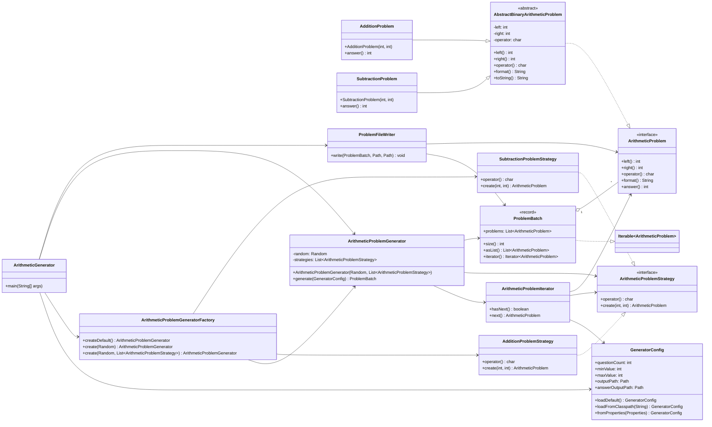

# plusTest

plusTest 是一个基于 Java 21 和 Maven 的加减法练习题生成器。项目会按照配置生成指定数量、指定数字范围内的题目，并写入本地文件。

## 功能

- 生成加法和减法题
- 支持配置题目数量
- 支持配置数字生成范围
- 支持配置输出文件路径
- 支持生成答案文件
- 减法题默认不会生成负数结果
- 自动创建输出目录
- 包含单元测试和测试数据
- 使用接口、抽象类、工厂模式、策略模式和迭代器模式组织核心逻辑

## 项目结构

```text
src/main/java/com/sylphy
├── ArithmeticGenerator.java          # 程序入口
├── config/GeneratorConfig.java       # 生成配置加载和校验
├── factory/ArithmeticProblemGeneratorFactory.java # 生成器工厂
├── iterator/ArithmeticProblemIterator.java # 题目生成迭代器
├── model/
│   ├── ArithmeticProblem.java        # 算术题接口
│   ├── AbstractBinaryArithmeticProblem.java # 算术题抽象基类
│   ├── AdditionProblem.java          # 加法题
│   ├── SubtractionProblem.java       # 减法题
│   └── ProblemBatch.java             # 题目批次抽象数据类型
├── service/ArithmeticProblemGenerator.java # 题目生成服务
├── strategy/
│   ├── ArithmeticProblemStrategy.java # 题目策略接口
│   ├── AdditionProblemStrategy.java   # 加法策略
│   └── SubtractionProblemStrategy.java # 减法策略
└── writer/ProblemFileWriter.java     # 文件写入服务

src/main/resources/application.properties       # 默认运行配置
src/test/java/com/sylphy                         # 单元测试
src/test/resources/generator-config-cases.json      # JSON 测试配置数据
```



## 配置说明

默认配置文件：

```text
src/main/resources/application.properties
```

可配置项：

```properties
question.count=100
value.min=0
value.max=100
output.path=output/math-problems.txt
answer.output.path=output/math-answers.txt
```

说明：

- `question.count`：生成题目数量，必须大于 0。
- `value.min`：操作数最小值，必须大于等于 0。
- `value.max`：操作数最大值，必须大于等于 `value.min`。
- `output.path`：题目输出文件路径。
- `answer.output.path`：答案输出文件路径。

## 运行

```bash
mvn test
java -cp target/classes com.sylphy.ArithmeticGenerator
```

运行后默认生成：

```text
output/math-problems.txt
output/math-answers.txt
```

输出示例：

```text
1. 3 + 5 = 
2. 8 - 2 = 
```

答案示例：

```text
1. 8
2. 6
```

## 测试

```bash
mvn test
```

测试覆盖：

- 配置加载和校验
- JSON 测试数据读取
- 题目模型格式化和答案计算
- 题目策略创建和减法归一化
- 题目迭代器、生成数量、范围和减法非负
- 题目文件和答案文件写入
- 文件写入和目录创建

## Git 管理

- `src/`、`pom.xml`、`README.md`、配置文件和测试文件需要提交。
- `target/` 是 Maven 构建目录，不提交。
- `output/` 是运行生成目录，不提交。
